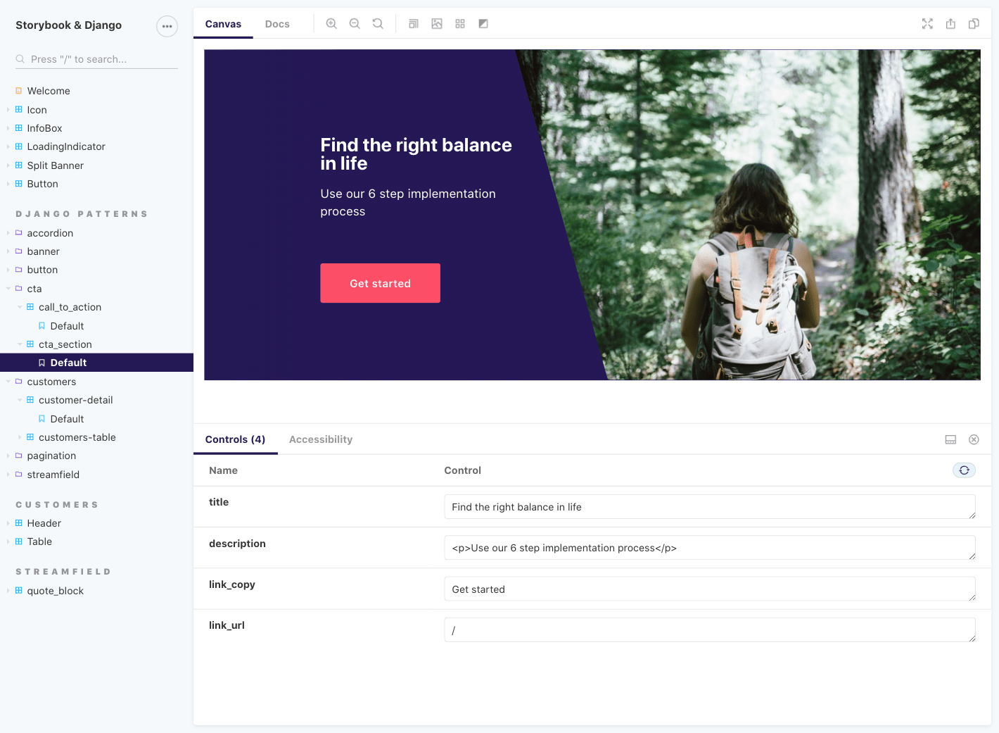

# Storybook for Django 

[](https://www.npmjs.com/package/storybook-django) [](https://github.com/torchbox/storybook-django/actions)

Storybook for Django is an experimental UI development environment for Django components. It allows you to implement, document, and test UI components in isolation from your Django views.



## How it works

Server-side, this uses [django-pattern-library](https://github.com/torchbox/django-pattern-library) to mock template context and template tags. Client-side, we use [Storybook](https://storybook.js.org/) to create stories from our templates.

## Getting started

Let’s get you set up. There are two requirements:

1. First, start by setting up [django-pattern-library](https://github.com/torchbox/django-pattern-library), v0.7.0 and up. Have a look at our [demo settings.py](https://github.com/torchbox/storybook-django/blob/main/demo/settings.py) as an example.
2. Then, set up [Storybook](https://storybook.js.org/). We expect `storybook-django` to work with any framework supported by Storybook, and provide built-in support for React (Vue in progress).

Next, install our package:

```sh
npm install --save-dev storybook-django
```

### Middleware

Add a `middleware.js` inside your Storybook configuration folder (`.storybook` by default):

```js
const {
  createDjangoAPIMiddleware,
} = require('storybook-django/src/middleware');

module.exports = createDjangoAPIMiddleware({
  // Point this at your Django runserver instance, with the correct port number.
  origin: 'http://localhost:8001',
  apiPath: ['/pattern-library/'],
});
```

This will forward pattern library API requests to Django. You may optionally add more API path patterns to `apiPath` to make other requests to your Django backend.

### Optional Webpack configuration

This is optional but highly recommended. To leverage Storybook’s live-reloading and documentation capabilities, we need to configure it to load our templates. Edit your Storybook `main.js` file to customise the `webpackFinal` option:

```js
module.exports = {
  webpackFinal: (config) => {
    config.module.rules = config.module.rules.concat([
      {
        test: /\.html$/,
        // Webpack 5:
        type: 'asset/source',
        // Webpack 4 (make sure to also install the raw-loader package):
        // use: 'raw-loader',
      },
    ]);

    return config;
  }
```

### React usage

Here is the most basic story for a Django template:

```js
import { Pattern } from 'storybook-django/src/react';

export default {};

export const Base = () => (
  <Pattern
    template="patterns/components/streamfield/heading_block.html"
    context={{ value: 'An important section' }}
  />
);
```

`Pattern` uses a hard-coded `endpoint` of `/pattern-library/api/v1/render-pattern` by default. To change this, pass a different value. For example,

```js
<Pattern endpoint="/storybook-patterns/api/v1/render-pattern" />
```

If this is a necessity for your project, consider creating your own wrapper for the `Pattern` component rather than having to define the `endpoint` in all stories.

#### With auto-generated template paths

Our `Pattern` component has to be told which `template` to render, Alternatively, we can use [Webpack’s `__filename`](https://webpack.js.org/api/module-variables/#__filename-nodejs) support to auto-generate the template path. First, configure Webpack:

```js
config.node = {
  __filename: true,
};
```

Then, use the `filename` prop instead of `template`:

```js
<Pattern filename={__filename} />
```

This `filename` prop assumes the template is in the same folder as the template, with the same file name except for the extension (replaces `.stories.(js|tsx)` with `.html`).

#### With Storybook features

And here is a more advanced examples, showcasing different Storybook features:

- Setting a custom title for the story.
- Loading Markdown files to use as documentation.
- Loading the component’s template to display alongside the docs, and for live-reloading.
- Setting up [controls](https://storybook.js.org/docs/react/essentials/controls).
- Having multiple stories with different data.

```js
import { Pattern } from 'storybook-django/src/react';

import docs from './quote_block.md';
import template from './quote_block.html';

export default {
  title: 'Components / quote_block',
  parameters: {
    docs: {
      source: { code: template },
      extractComponentDescription: () => docs,
    },
  },
  argTypes: {
    quote: {
      control: { type: 'text' },
      description: 'Will be displayed first',
    },
    attribution: {
      control: { type: 'text' },
      description: 'Underneath the quote (optional)',
    },
  },
};

export const Base = (args) => (
  <Pattern filename={__filename} context={{ value: args }} />
);

Base.args = {
  quote: 'Someone believed in me once and now it’s time for me to do the same.',
  attribution: 'Young person',
};

export const NoAttribution = Base.bind({});

NoAttribution.args = {
  quote: Base.args.quote,
  attribution: null,
};
```

#### Making the most of React

The point of using React is to be able to fully customise the context within which our Django components are displayed. Here is an example, with a simple SVG icon template:

```js
const IconPattern = (props) => (
  <Pattern
    element="span"
    template="patterns/components/icon/icon.html"
    context={props}
  />
);

export const ReactDemoStory = () => (
  <span>
    <a href="https://www.example.com">
      View our complete guide <IconPattern name="arrow" />
    </a>
  </span>
);
```

### Vue usage

We are working on Vue support. Please refer to [Usage with Vue #7](https://github.com/torchbox/storybook-django/issues/7) in the meantime, and provide feedback.

### Usage with other frameworks

storybook-django’s implementation is largely framework-agnostic, and should work equally as well with Storybook’s HTML and Web Components support.

You will need to directly import the imperative APIs:

```js
import {
  renderPattern,
  simulateLoading,
  insertHTMLWithScripts,
} from 'storybook-django';
```

- `renderPattern` calls the django-pattern-library API rendering endpoint.
- `simulateLoading` includes `insertHTMLWithScripts`, and fires a `DOMContentLoaded` event.
- `insertHTMLWithScripts` is like `.innerHTML`, but additionally executing any `<script>` tags.

### TypeScript usage

There is nothing particular to change to make storybook-django work with TypeScript. Just make sure to configure TypeScript to understand `.md` and `.html` files if you use those features – here is a sample `stories.d.ts` file:

```ts
declare module '*.md';
declare module '*.html';
```

### Tag overrides

[Tag overrides](https://torchbox.github.io/django-pattern-library/guides/overriding-template-tags/) are a feature of django-pattern-library. They’re very simple to use with storybook-django too. Here is an example:

```js
import React from 'react';
import { Pattern, generateDocs } from 'storybook-django/src/react';

import template from './page_status_tag_new.html';

export default {};

const PublicTemplate = (args) => (
  <Pattern
    filename={__filename}
    tags={{
      test_page_is_public: {
        'page as is_public': {
          raw: false,
        },
      },
    }}
    context={{ page: args }}
  />
);

export const Public = PublicTemplate.bind({});
Public.args = {
  live: true,
  url: '#',
};
```

This is the same API as that of django-pattern-library, but as JS objects rather than YAML.

### Advanced usage

`storybook-django` is still very experimental. Head over to [Discussions](https://github.com/torchbox/storybook-django/discussions) to share information about more advanced usage.

#### Storyshots support

`storybook-django` is compatible with Storyshots, with a few constraints due to rendering happening with Django via an API:

1. We need a running Django server while the Storyshots test suite is running.
2. Components render asynchronously, so we need to make sure to test the final rendering _from Django_, rather than an intermediary state.
3. We need to use Jest’s `jsdom` environment, and include a polyfill for `window.fetch` such as `whatwg-fetch`.

Getting a Django server up and running is as simple as starting it in the background ahead of running the test suite. Here is a [GitHub Actions example](https://github.com/torchbox/storybook-django/blob/main/.github/workflows/ci.yml#L48-L70):

```yaml
- run: source .venv/bin/activate && python manage.py runserver 0:8001 &
- run: npm run test
```

To check whether Django patterns have finished rendering, we use a `data-state="loaded"` attribute set by storybook-django when it first inserts the HTML into the DOM. Here is an [example of automated accessibility tests with Axe](https://github.com/torchbox/storybook-django/blob/main/demo/static_src/tests/storyshots-axe.test.js), with `@testing-library/react`:

```js
const { container, queryAllByTestId } = render(story.render());

const patterns = queryAllByTestId('storybook-django');

if (patterns.length > 0) {
  await waitFor(
    () => expect(patterns.map((p) => p.dataset.state)).toContain('loaded'),
    { timeout: 10000 },
  );
}
```

#### Storyshots: snapshots

After checking the patterns are loaded, it’s as simple as `expect(container).toMatchSnapshot();`. See the [full snapshot example](https://github.com/torchbox/storybook-django/blob/main/demo/static_src/tests/storyshots-snapshot.test.js).

#### Storyshots: accessibility

With `jest-axe`, after checking the patterns are loaded,

```js
const results = await axe(container, {
  // See https://github.com/dequelabs/axe-core/blob/develop/doc/rule-descriptions.md for a list of rules.
  // Try to only disable rules if strictly needed, alternatively also consider excluding stories from those tests
  // with the `storyshots` parameter: https://github.com/storybookjs/storybook/tree/master/addons/storyshots/storyshots-core#disable.
  rules: {
    // Disabled because stories are expected to be rendered outside of landmarks for testing.
    region: { enabled: false },
  },
});

expect(results).toHaveNoViolations();
```

See the [full jest-axe example](https://github.com/torchbox/storybook-django/blob/main/demo/static_src/tests/storyshots-axe.test.js).

#### Storyshots: image snapshots

This is possible as well, with Storybook’s `@storybook/addon-storyshots-puppeteer`. View the [full image snapshots example](https://github.com/torchbox/storybook-django/blob/main/demo/static_src/tests/storyshots-image-snapshot.test.js).

#### YAML for mock context and tags

A few of the stories in our demo project use YAML to store a pattern’s mock context and tags. This is largely a demonstration of compatibility with how [django-pattern-library](https://github.com/torchbox/django-pattern-library) works, and for most users defining context and tags with Storybook APIs is more suitable. There are a few cases where the YAML setup can help:

- There is currently no way to override context in _other templates_ via API calls. YAML files make this possible.
- Similarly there is no way to override tags in other templates – again made possible with YAML files.

### Hosting

Since storybook-django relies on a Django backend, in this context the Storybook export can’t be hosted as a fully static site. We instead need to:

1. Build a static export with `build-storybook`
2. Configure a Django server to serve the static export
3. Host the Django server

This repository’s `demo` site has an example of how to do this, serving the static files with Django’s `django.views.static.serve`.

## Common questions

### How does this compare with django-pattern-library?

[django-pattern-library](https://github.com/torchbox/django-pattern-library) makes it possible to work with Django templates as UI components. It comes with its own rudimentary pattern library UI. storybook-django uses [Storybook](https://storybook.js.org/)’s UI instead, and Storybook’s APIs to work on components, write tests, and documentation.

### Features comparison table

| Feature                                 | django-pattern-library                                                                                                                                                    | storybook-django                                                                                                                                                        |
| --------------------------------------- | ------------------------------------------------------------------------------------------------------------------------------------------------------------------------- | ----------------------------------------------------------------------------------------------------------------------------------------------------------------------- |
| UI framework support                    | Vanilla Django templates only                                                                                                                                             | Vanilla templates and all frameworks Storybook supports                                                                                                                 |
| Dependencies                            | 1 PyPI package                                                                                                                                                            | 1 PyPI package, 1 npm package, all Storybook dependencies                                                                                                               |
| Hosting                                 | Django server or [static site export](https://torchbox.github.io/django-pattern-library/guides/static-site-export/)                                                       | Django server only                                                                                                                                                      |
| Components documentation                | Separate Markdown file                                                                                                                                                    | Storybook [Docs addon](https://storybook.js.org/addons/@storybook/addon-docs) with separate Markdown file, or Django templates comments extraction, or write in stories |
| Browser support                         | No restrictions                                                                                                                                                           | Modern browsers only                                                                                                                                                    |
| Live reload                             | No (bring your own)                                                                                                                                                       | Yes, if configured                                                                                                                                                      |
| View components at multiple breakpoints | Yes, with [predefined breakpoints only](https://github.com/torchbox/django-pattern-library/issues/101)                                                                    | Yes, with [viewport addon](https://storybook.js.org/docs/react/essentials/viewport)                                                                                     |
| Tweak template data in UI               | No                                                                                                                                                                        | Yes, Storybook [controls](https://storybook.js.org/docs/react/essentials/controls)                                                                                      |
| Component variations                    | [No](https://torchbox.github.io/django-pattern-library/reference/known-issues/#no-support-for-pattern-variations)                                                         | Yes                                                                                                                                                                     |
| Component status                        | [No](https://github.com/torchbox/django-pattern-library/issues/91)                                                                                                        | Yes, with Docs addon                                                                                                                                                    |
| Components homepage                     | [No](https://github.com/torchbox/django-pattern-library/issues/94) (build your own)                                                                                       | No (build your own)                                                                                                                                                     |
| Pattern library theming                 | [No](https://github.com/torchbox/django-pattern-library/issues/107)                                                                                                       | Yes                                                                                                                                                                     |
| Customizing a component’s surroundings  | No, [create a new template for this](https://torchbox.github.io/django-pattern-library/guides/customizing-template-rendering/#customizing-a-single-patterns-surroundings) | Yes                                                                                                                                                                     |
| Automated snapshot tests                | [Basic support](https://torchbox.github.io/django-pattern-library/guides/automated-tests/#with-render_patterns)                                                           | Yes, with [Storyshots](https://storybook.js.org/addons/@storybook/addon-storyshots)                                                                                     |
| Automated accessibility tests           | [Basic support](https://torchbox.github.io/django-pattern-library/guides/automated-tests/#accessibility-testing)                                                          | Yes, with [Storyshots](https://storybook.js.org/addons/@storybook/addon-storyshots) or [a11y addon](https://www.npmjs.com/package/@storybook/addon-a11y)                |
| Automated visual regression tests       | [Basic support](https://torchbox.github.io/django-pattern-library/guides/automated-tests/#visual-regression-testing)                                                      | Yes, with [Storyshots](https://storybook.js.org/addons/@storybook/addon-storyshots) or any other Storybook integration                                                  |

### How does this compare with Storybook’s official server support?

Compared to this project, [`@storybook/server`](https://www.npmjs.com/package/@storybook/server) only supports simple use cases.

### What is the future of storybook-django?

See [torchbox/django-pattern-library#103 – Storybook prototype of the pattern library](https://github.com/torchbox/django-pattern-library/issues/103) for more context on this project, and to keep up with changes to it in relation with django-pattern-library.

### Should I use storybook-django, or stick with django-pattern-library only?

Are Storybook’s capabilities appealing to you? Consider using storybook-django. If not, stick with django-pattern-library if you’re ok with its [known limitations](https://torchbox.github.io/django-pattern-library/reference/known-issues/). It’s simpler to start with django-pattern-library and add Storybook later, than the other way around.

## Contributing

See anything you like in here? Anything missing? We welcome all support, whether on bug reports, feature requests, code, design, reviews, tests, documentation, and more. Please have a look at our [contribution guidelines](CONTRIBUTING.md).

If you just want to set up the project on your own computer, the contribution guidelines also contain all of the setup commands.

## Credits

View the full list of [contributors](https://github.com/torchbox/storybook-django/graphs/contributors). [MIT](LICENSE) licensed.
